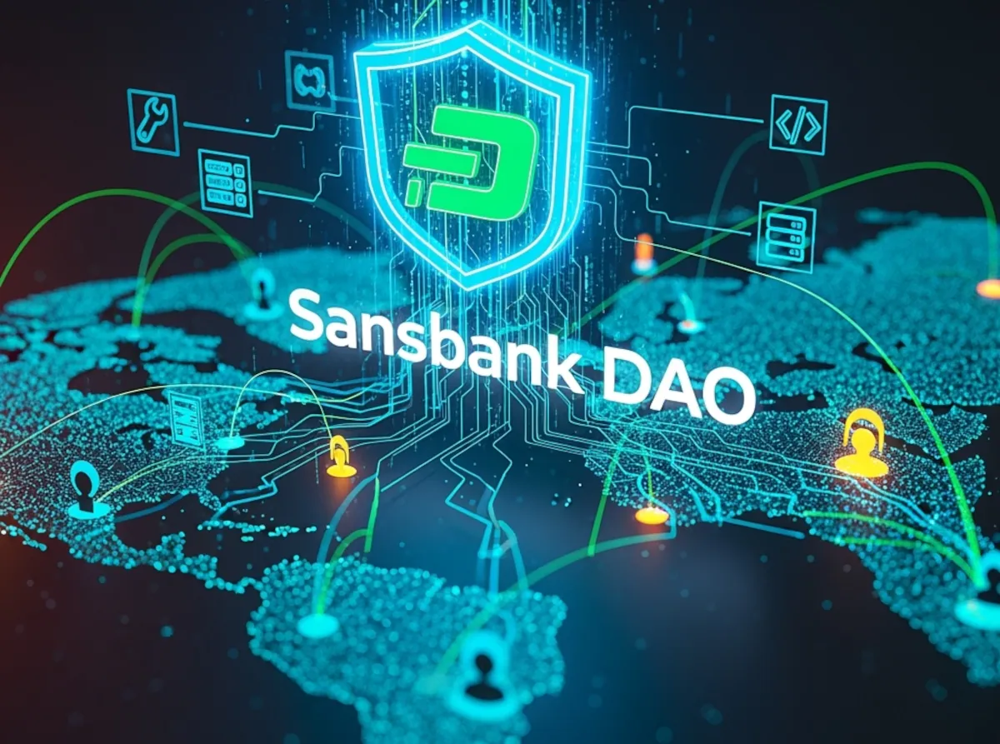

# Sansbank DAO

### https://sansbank.org

#### Empowering a Bank-Free Future

Sansbank DAO is at the forefront of the DASH Evolution — driving Platform innovations in developer tooling and infrastructure scalability to bring a decentralized economy to every individual worldwide.

#### 🗳️ Your crypto, in your hands

Sansbank will not store your private keys or recovery seed, all our hardware and software are open source.

#### 👁️ Truly open source

Open source means that we don't hide any code and are open to inspection by everyone, which takes courage and commitment.

#### 🔐 End-to-end encryption

Sansbank uses industry-leading encryption technology to store your information locally. Only you can decrypt that information.

## 🛖 Repos

* [EvoNext](https://github.com/sansbankdao/evonext-app) - Decentralized Social Network
* [DashSwap](https://github.com/sansbank/dashswap) - Decentralized Exchange + Launchpad (DEX)
* [Dash USD]() - Algorithmic + Agentic Dash Stablecoin
* [DashQt](https://github.com/sansbank/dashqt) - EVM App Execution Layer
* [Dash Limo]() - Consumer Payments IRL

## 🦦 Find Us

* Website: https://sansbank.org
* X: https://x.com/SansbankDAO
* Support: https://sansbank.org/help
* Developer Guides: https://sansbank.org/readme
* Open Positions: https://sansbank.org/jobs

## 🙋‍♂️ We're Hiring!

<table>
    <thead>
        <tr>
            <th colspan="2"> We are hiring many roles (Remote)
            <a href="https://sansbank.org/jobs">👉 Click here to check all open positions</a>
            </th>
        </tr>
    </thead>
    <tbody>
        <tr>
            <td>
            <li> Remote (Live anywhere)</li>
            <li> Global Pay (Literally)</li>
            <li> ESOP (For everybody)</li>
            <li> Open Source (As you see)</li>
            <li> Awesome Colleagues (Hell Yeah!)</li>
            </td>
        </tr>
    </tbody>
</table>
